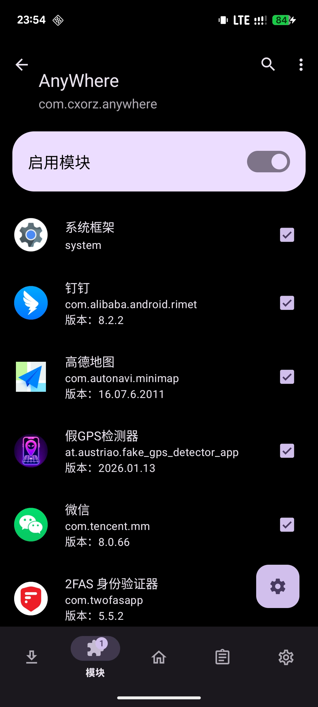

# AnyWhere

**AnyWhere** 是一款轻量级的 Android 位置模拟工具，专为开发者调试 LBS 应用及用户测试地理位置功能而设计。

## 主要功能

*   **现代 UI 设计**：基于 **Material Design 3** 设计规范，提供简洁、现代且富有活力的视觉体验。
*   **暗黑模式**：深度适配系统深色主题。
*   **精准模拟**：支持在地图上点选任意坐标进行模拟定位。
*   **摇杆控制**：悬浮摇杆，支持模拟步行、跑步、驾车等不同速度的移动。
*   **历史记录**：自动保存历史定位记录；进入默认定位到上次的位置。
*   **真实朝向**：同步手机物理朝向，使模拟位置的方向随手机转动而实时变化。
*   **Mock 隐藏**：集成 LSPosed 模块功能，隐藏模拟位置标记，绕过大部分应用的模拟位置检测。

## 预览

| 欢迎页面 | 地图主页 | LSPosed 模块设置 |
| :---: | :---: | :---: |
|  |  |  |

## 使用前必读

为确保应用正常运行，请按以下步骤操作：

1.  **开启开发者模式**：前往系统设置开启“开发者选项”。
2.  **设置模拟应用**：进入“开发者选项” -> “选择模拟位置信息应用”，在列表中选中 **AnyWhere**。
3.  **权限授予**：首次启动时，请授予应用必要的定位和悬浮窗权限。
4. **LSPosed (可选)**：启用模块，勾选 “系统框架”、“你的目标应用”，以防止位置模拟检测

## 免责声明

**请务必仔细阅读以下条款，下载、安装或使用本软件即表示您已阅读并同意本免责声明：**

1.  **用途限制**：本软件仅供**软件开发调试**、**功能测试**及**个人学习研究**使用。**严禁**将本软件用于任何违反法律法规、侵犯他人权益或违反第三方平台规则的行为（包括但不限于虚假考勤打卡、游戏作弊、网络欺诈等）。
2.  **后果自负**：因用户违规使用本软件而产生的任何后果（包括但不限于账号封禁、服务中断、数据丢失、法律纠纷等），均由用户**自行承担**。开发者对用户的使用行为不承担任何直接或间接的法律责任或连带责任。
3.  **无担保**：本软件按“现状”提供，不包含任何明示或暗示的保证。开发者不保证软件在所有设备或系统版本上的绝对稳定性、兼容性及准确性。
4.  **隐私保护**：本软件承诺不收集、不存储、不上传用户的任何个人隐私数据或真实位置信息。

## 致谢

本项目基于开源项目 [GoGoGo](https://github.com/ZCShou/GoGoGo) 进行二次开发。

我们在原项目的基础上进行了深度的精简与重构：
- 移除了百度的专有地图 SDK，全面替换为开源的 **OpenStreetMap**。
- 精简了冗余的 UI 和功能，提升了应用的启动速度和运行效率。
- 重写了部分核心逻辑，以适应新的架构需求。

在此向原作者 [ZCShou](https://github.com/ZCShou) 及其贡献者致以诚挚的感谢，感谢其开源精神为社区带来的贡献。

## 开源协议 (License)

本项目遵循 **GNU General Public License v3.0 (GPL-3.0)** 协议。

*   **AnyWhere** © 2026 Cxorz.
*   Based on **GoGoGo** © ZCShou.

您可以自由地复制、修改和分发本项目，但请务必遵守 GPL v3.0 协议的规定（包括保持开源、保留原作者版权声明等）。详细条款请参阅项目根目录下的 [LICENSE](LICENSE) 文件。

---
*本项目仅供技术交流与学习使用，请勿用于非法用途。*
